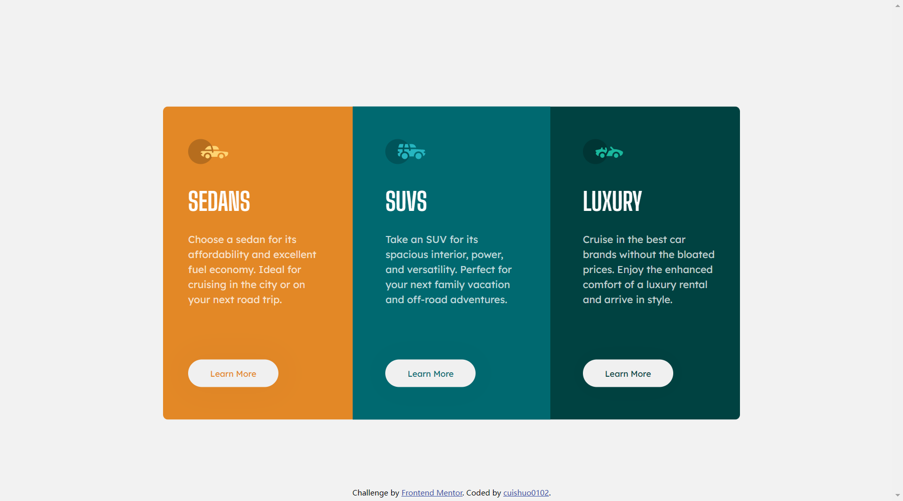

# Frontend Mentor - 3-column preview card component solution

This is a solution to the [3-column preview card component challenge on Frontend Mentor](https://www.frontendmentor.io/challenges/3column-preview-card-component-pH92eAR2-). Frontend Mentor challenges help you improve your coding skills by building realistic projects. 

## Table of contents

- [Overview](#overview)
  - [The challenge](#the-challenge)
  - [Screenshot](#screenshot)
  - [Links](#links)
- [My process](#my-process)
  - [Built with](#built-with)
  - [What I learned](#what-i-learned)
  - [Continued development](#continued-development)
  - [Useful resources](#useful-resources)
- [Author](#author)

## Overview

### The challenge

Users should be able to:

- View the optimal layout depending on their device's screen size
- See hover states for interactive elements

### Screenshot

### Links

- Solution URL: [GitHub](https://github.com/cuishuo0102/3-column-preview-card-component)
- Live Site URL: [Github Pages](https://cuishuo0102.github.io/3-column-preview-card-component)

## My process

### Built with

- Semantic HTML5 markup
- CSS custom properties
- Mobile-first workflow
- [Bootstrap Grid](https://getbootstrap.com/docs/5.3/layout/grid/) - Grid System
- Google Web Font

### What I learned
#### CSS properties can be declared in any node, and it is passed dynamically, not lexically.

#### Unapplied CSS Properties
There are three possible conditions that CSS properties don't get applied. In Chrome devtool, there are four common conditions with the property:

- Warning icon before: unkonow property name or invalid property value
- With strikethrough line: overriden
- Pale text with icon: no effect because of other properties
- Pale text in inherit section: not inherited properties

#### A Common cause of counterintuitive CSS property overriding is the order of rules in CSS declaration.

### Continued development
- Rewrite CSS with SCSS

### Useful resources

- [Bootstrap Grid](https://getbootstrap.com/docs/5.3/layout/grid) - Bootstrap grid system provides non-gutter grid system and semantic class names.
- [Find invalid, overridden, inactive, and other CSS](https://developer.chrome.com/docs/devtools/css/issues/) - This is an amazing article which helped me finally understand the reasons that CSS properties not get applied and give a clear way to identify the reason using devtool. I'd recommend it to anyone still learning this concept.
- [Pseudo-classes](https://developer.mozilla.org/en-US/docs/Web/CSS/Pseudo-classes) - This is a full list of pseudo class in CSS, taking an overview helps me know how many are they and make them can be recalled during development.
- [width:100VW Side Scroll behavior (& fix)](https://sbx.webflow.io/100vw-scrollbars) - This article helped me understand why the scrollbar is showing while using 100vw. It clearly point out this browser bug and give the way to fix it.

## Author

- Website - [cuishuo0102](https://github.com/cuishuo0102)
- Frontend Mentor - [@cuishuo](https://www.frontendmentor.io/profile/cuishuo0102)
